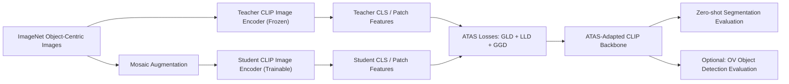

# 深度学习课程大作业第2周方案汇报

题目：ATAS: Any-to-Any Self-Distillation for Enhanced Open-Vocabulary Dense Prediction 复现

建议汇报时长：5 分钟  
汇报目标：明确复现论文、说明算法改进点、展示初步架构设计与组员分工。

---

## Slide 1：选题信息

### 复现论文

- 论文名称：**ATAS: Any-to-Any Self-Distillation for Enhanced Open-Vocabulary Dense Prediction**
- 会议：**ICCV 2025**
- 任务方向：**开放词汇密集预测**
- 涉及任务：
  - 开放词汇语义分割
  - 开放词汇目标检测
- 复现目标：
  - 复现 ATAS 的核心自蒸馏训练方法
  - 在课程规模下验证其对 CLIP dense prediction 能力的提升

### 选择原因

- ICCV 属于 CCF A 类会议，符合课程要求。
- 方法核心清晰，主要改进集中在 CLIP 图像编码器自蒸馏。
- 不依赖人工标注训练，只使用 ImageNet 图像，适合课程复现。
- 论文实验包含主实验和消融实验，便于设计测试报告。

---

## Slide 2：研究背景与问题

### 背景

CLIP 在图像-文本对比学习中表现很好，可以完成开放词汇识别；但 CLIP 原始训练主要对齐的是整张图像的 CLS token 和文本特征。

### 问题

在语义分割、目标检测等 dense prediction 任务中，需要模型理解图像局部区域。

原始 CLIP 存在两个核心不足：

- **局部 patch token 与文本语义对齐不足**
  - patch 特征没有直接经过文本监督。
  - 导致局部区域分类、定位能力不稳定。
- **已有微调方法可能破坏局部语义一致性**
  - 一些方法强化局部对齐时，会损害 CLIP 原有的语义结构。

### ATAS 的目标

同时提升：

- **Fine-grained alignment**：局部区域和文本语义更好对齐。
- **Semantic coherence**：同一语义区域内部的 patch 表征保持一致。

---

## Slide 3：算法核心改进点

ATAS 提出 **Any-to-Any Self-Distillation**，使用冻结的原始 CLIP 作为 teacher，训练一个 student CLIP image encoder。

### 1. Global-to-Local Distillation，GLD

作用：把 CLIP CLS token 中已有的全局语义知识迁移到 patch token。

核心思想：

- teacher 提供单张 object-centric 图像的 CLS 特征。
- student 从 mosaic 图像中提取 patch 特征。
- 对与目标语义更相关的 patch 加权聚合。
- 用对比学习让局部聚合特征接近对应的 teacher CLS 特征。

效果：

- 增强 patch token 的开放词汇语义对齐能力。
- 对分割和检测最关键。

### 2. Local-to-Local Distillation，LLD

作用：保持 CLIP 原本的局部语义结构。

核心思想：

- 不直接强迫 patch 特征完全相同。
- 而是蒸馏 teacher patch 之间的两两相似度关系。
- student 学习保持局部 patch 的关系结构。

效果：

- 减少特征漂移。
- 保留同一物体或语义区域内部的一致性。

### 3. Global-to-Global Distillation，GGD

作用：防止训练过程中破坏 CLIP 的全局语义能力。

核心思想：

- student 的 CLS token 继续对齐 teacher 的 CLS token。
- 使用 batch 内对比学习保持全局表征稳定。

效果：

- 维持 CLIP 原有分类和图文对齐能力。
- 让模型在局部增强的同时不丢失全局语义。

---

## Slide 4：整体架构设计

### 初步复现架构

### 模块划分

- 数据模块
  - ImageNet 数据下载、解压、ImageFolder 格式整理。
  - Mosaic augmentation，构造 2x2、4x4、6x6 拼接图像。
- 模型模块
  - 使用 OpenCLIP 加载 CLIP ViT-B/16。
  - teacher 冻结，student 只训练 image encoder。
- 损失模块
  - 实现 GLD、LLD、GGD 三个损失。
  - 支持消融实验：只用 GLD、GLD+LLD、完整 ATAS。
- 训练模块
  - 支持单卡/多卡训练、AMP、断点恢复。
  - 服务器环境：4 张 RTX A6000，每张 48GB 显存。
- 评估模块
  - 第一阶段：patch-level zero-shot segmentation。
  - 第二阶段：接入 MaskCLIP/SCLIP 做论文风格评估。
  - 扩展阶段：接入 F-ViT 做开放词汇检测。

---

## Slide 5：复现实验计划

### 第一阶段：跑通核心训练

- 准备 ImageNet 训练集。
- 跑通 ATAS 训练 pipeline。
- 得到 student CLIP image encoder checkpoint。

### 第二阶段：核心消融实验

对比以下设置：

| 实验设置 | GLD | LLD | GGD | 目标 |
| --- | --- | --- | --- | --- |
| Baseline CLIP | 否 | 否 | 否 | 原始 CLIP 表现 |
| GLD only | 是 | 否 | 否 | 验证全局到局部蒸馏 |
| GLD + LLD | 是 | 是 | 否 | 验证局部结构保持 |
| Full ATAS | 是 | 是 | 是 | 复现完整方法 |

### 第三阶段：下游任务评估

优先级：

1. Pascal VOC 语义分割小规模评估。
2. MaskCLIP / SCLIP 风格零样本分割评估。
3. 如果时间充足，扩展到开放词汇目标检测。

### 预期结果

- ATAS checkpoint 相比原始 CLIP，在局部 patch 语义对齐上更好。
- 在开放词汇语义分割中，mIoU 或 patch classification accuracy 有提升。
- 消融实验能体现 GLD、LLD、GGD 各模块贡献。

---

## Slide 6：组员分工

按照 10 人小组设计：

| 角色 | 人数 | 主要任务 |
| --- | ---: | --- |
| 队长 / 汇总负责人 | 1 | 方案设计、进度管理、汇报、文档整合 |
| 论文与方法组 | 2 | 精读论文、整理公式、对齐原文实验设置 |
| 数据组 | 1 | ImageNet / VOC 数据准备、路径管理、数据检查 |
| 训练工程组 | 3 | ATAS 训练代码、loss 实现、多卡训练、checkpoint 管理 |
| 评估实验组 | 2 | 分割评估、消融实验、指标统计、可视化结果 |
| 文档与测试对接组 | 1 | README、环境说明、设计文档、测试组交付材料 |

### 当前已完成

- 已确定复现论文：ATAS，ICCV 2025。
- 已完成初步代码框架：
  - ATAS 三个 loss。
  - Mosaic 数据流。
  - 单卡/多卡训练入口。
  - 服务器环境配置。
- 已连接实验室服务器：
  - 4 × RTX A6000。
  - 已创建 `atas` conda 环境。

### 下一步

- 完成 ImageNet 数据下载与解压整理。
- 先跑 debug 配置，验证训练流程。
- 启动正式训练并记录 loss 曲线。
- 实现第一版语义分割评估。

---

## 5 分钟汇报节奏建议

- 0:00 - 0:40：介绍选题和为什么选 ATAS。
- 0:40 - 1:40：讲背景问题，CLIP 在 dense prediction 上的不足。
- 1:40 - 3:00：讲三个核心改进 GLD、LLD、GGD。
- 3:00 - 4:10：讲架构设计和实验计划。
- 4:10 - 5:00：讲组员分工、当前进展、下一步计划。

---

## 口头汇报稿简版

我们组选定复现 ICCV 2025 论文 ATAS: Any-to-Any Self-Distillation for Enhanced Open-Vocabulary Dense Prediction。该论文面向开放词汇密集预测任务，包括语义分割和目标检测。我们选择它的原因是方法核心清晰，主要围绕 CLIP 图像编码器进行自蒸馏，不需要额外人工标注训练，并且论文提供了比较完整的主实验和消融实验，适合课程复现。

这篇论文关注的问题是：CLIP 虽然有很强的图文对齐能力，但它主要对齐的是整图 CLS token 和文本特征，patch token 没有直接经过文本监督，因此在分割、检测这类局部预测任务中表现有限。ATAS 认为 dense prediction 需要同时满足两个条件：局部区域要和文本语义对齐，同时同一语义区域内部的 patch 表征要保持一致。

为了解决这个问题，ATAS 提出三个自蒸馏损失。第一个是 Global-to-Local Distillation，把 teacher CLIP 的全局 CLS 语义迁移到 student 的局部 patch token。第二个是 Local-to-Local Distillation，通过蒸馏 patch 之间的相似度关系，保持 CLIP 原有局部语义结构。第三个是 Global-to-Global Distillation，让 student 的 CLS token 继续对齐 teacher 的 CLS token，避免训练过程中破坏全局语义能力。

我们的初步架构是：使用 ImageNet object-centric 图像作为无标注训练数据，先构造 mosaic 图像，然后用冻结的原始 CLIP 作为 teacher，用可训练的 CLIP image encoder 作为 student，通过 GLD、LLD、GGD 三个损失训练得到 ATAS backbone。下游评估方面，我们会先做轻量级零样本语义分割评估，再逐步接入 MaskCLIP 或 SCLIP，最后如果时间允许扩展到开放词汇目标检测。

分工方面，队长负责整体设计和汇报，论文组负责方法和公式整理，数据组负责 ImageNet 和评估数据集，训练工程组负责 ATAS 训练代码和多卡训练，评估组负责消融实验和指标统计，文档组负责 README、设计文档和测试组交付材料。目前我们已经完成了论文选择、初步代码框架和服务器环境配置，下一步是完成 ImageNet 数据准备，跑通 debug 训练，并开始正式实验。

